# Sơ Đồ Hệ Thống - Greenpan Design

Tài liệu này chứa các sơ đồ hệ thống được vẽ bằng Mermaid. Có thể xem trên GitHub hoặc các công cụ hỗ trợ Mermaid.

---

## 1. Sơ Đồ Tổng Quan Hệ Thống

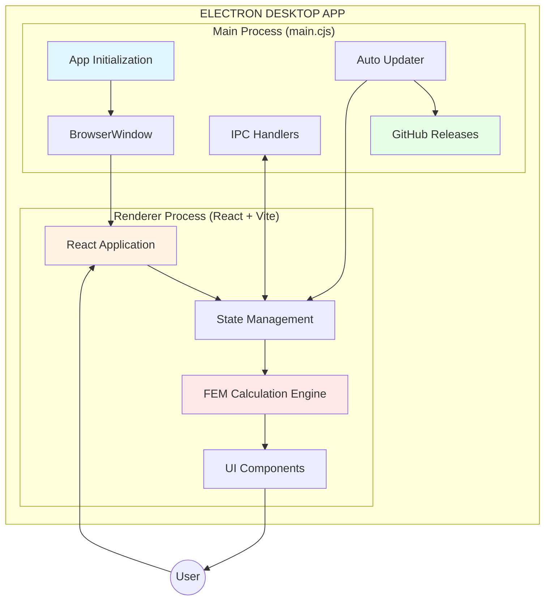

---

## 2. Kiến Trúc Chi Tiết Application

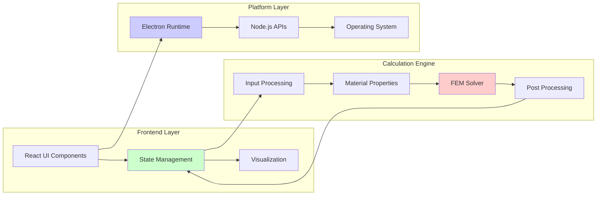

---

## 3. Luồng Dữ Liệu (Data Flow)

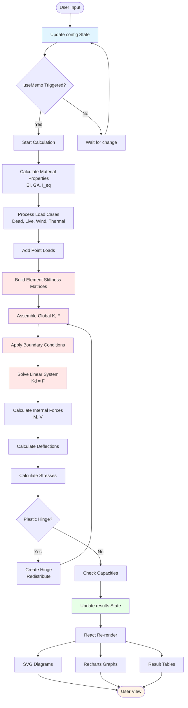

---

## 4. Kiến Trúc Component React

```mermaid
graph TB
    App[GreenpanDesign_Final<br/>Main Component]
    
    subgraph "UI State"
        S1[config State]
        S2[activeTab State]
        S3[printMode State]
        S4[updateStatus State]
    end
    
    subgraph "Computed Values"
        Calc[useMemo: results]
    end
    
    subgraph "Visual Components"
        Header[Header Component]
        Nav[Navigation Tabs]
        TabInput[Input Tab]
        TabCharts[Charts Tab]
        TabReport[Report Tab]
    end
    
    subgraph "Input Tab Content"
        I1[Project Settings]
        I2[Material Inputs]
        I3[Geometry Inputs]
        I4[Load Inputs]
        I5[BeamDiagram/CeilingSchematic]
    end
    
    subgraph "Charts Tab Content"
        C1[Deflection Chart]
        C2[Moment Diagram]
        C3[Shear Diagram]
        C4[Stress Distribution]
    end
    
    subgraph "Report Tab Content"
        R1[Report Header]
        R2[Input Summary]
        R3[Schematic Diagram]
        R4[All Charts]
        R5[Results Summary]
        R6[Conclusion]
        R7[Print Button]
    end
    
    App --> S1
    App --> S2
    App --> S3
    App --> S4
    
    S1 --> Calc
    
    App --> Header
    App --> Nav
    App --> TabInput
    App --> TabCharts
    App --> TabReport
    
    TabInput --> I1
    TabInput --> I2
    TabInput --> I3
    TabInput --> I4
    TabInput --> I5
    
    TabCharts --> C1
    TabCharts --> C2
    TabCharts --> C3
    TabCharts --> C4
    
    TabReport --> R1
    TabReport --> R2
    TabReport --> R3
    TabReport --> R4
    TabReport --> R5
    TabReport --> R6
    TabReport --> R7
    
    Calc --> I5
    Calc --> C1
    Calc --> C2
    Calc --> C3
    Calc --> C4
    Calc --> R4
    Calc --> R5
    
    style App fill:#ffcccc
    style Calc fill:#ccffcc
    style S1 fill:#e1f5ff
```

---

## 5. FEM Solver Architecture

```mermaid
graph TB
    Input[Input: spans, loads, materials]
    
    subgraph "Pre-Processing"
        PP1[Calculate EI, GA]
        PP2[Process Load Combinations]
        PP3[Convert Units]
        PP4[Build Point Load Array]
    end
    
    subgraph "Element Level"
        E1[timoshenkoElementK<br/>4x4 Stiffness Matrix]
        E2[consistentLoadUDL<br/>Load Vector]
        E3[consistentLoadPoint<br/>Point Load Vector]
    end
    
    subgraph "Global Assembly"
        G1[Loop over elements]
        G2[Create DOF mapping]
        G3[Assemble K matrix]
        G4[Assemble F vector]
    end
    
    subgraph "Boundary Conditions"
        BC1[Set v=0 at supports]
        BC2[Separate free/constrained DOFs]
        BC3[Extract Kff, Ff]
    end
    
    subgraph "Solution"
        Sol1[solveLinear<br/>Gaussian Elimination]
        Sol2[Back substitution]
        Sol3[Full displacement vector]
    end
    
    subgraph "Post-Processing"
        Post1[Calculate Reactions]
        Post2[Element Forces M, V]
        Post3[Interpolate at plot points]
        Post4[Calculate Stresses]
    end
    
    subgraph "Plastic Analysis"
        PA1{|M| > M_Rd?}
        PA2[Create Hinge at node]
        PA3[Split rotation DOF]
        PA4[Iteration counter++]
    end
    
    Input --> PP1
    PP1 --> PP2
    PP2 --> PP3
    PP3 --> PP4
    
    PP4 --> E1
    PP4 --> E2
    PP4 --> E3
    
    E1 --> G1
    E2 --> G1
    E3 --> G1
    
    G1 --> G2
    G2 --> G3
    G3 --> G4
    
    G4 --> BC1
    BC1 --> BC2
    BC2 --> BC3
    
    BC3 --> Sol1
    Sol1 --> Sol2
    Sol2 --> Sol3
    
    Sol3 --> Post1
    Post1 --> Post2
    Post2 --> Post3
    Post3 --> Post4
    
    Post2 --> PA1
    PA1 -->|Yes| PA2
    PA2 --> PA3
    PA3 --> PA4
    PA4 -->|iter < 4| G1
    PA1 -->|No| Output[Output: results]
    PA4 -->|iter >= 4| Output
    
    Post4 --> Output
    
    style E1 fill:#ffe7e7
    style Sol1 fill:#fff4e6
    style Post2 fill:#e7ffe7
    style PA1 fill:#ffcccc
```

---

## 6. Auto-Update Mechanism

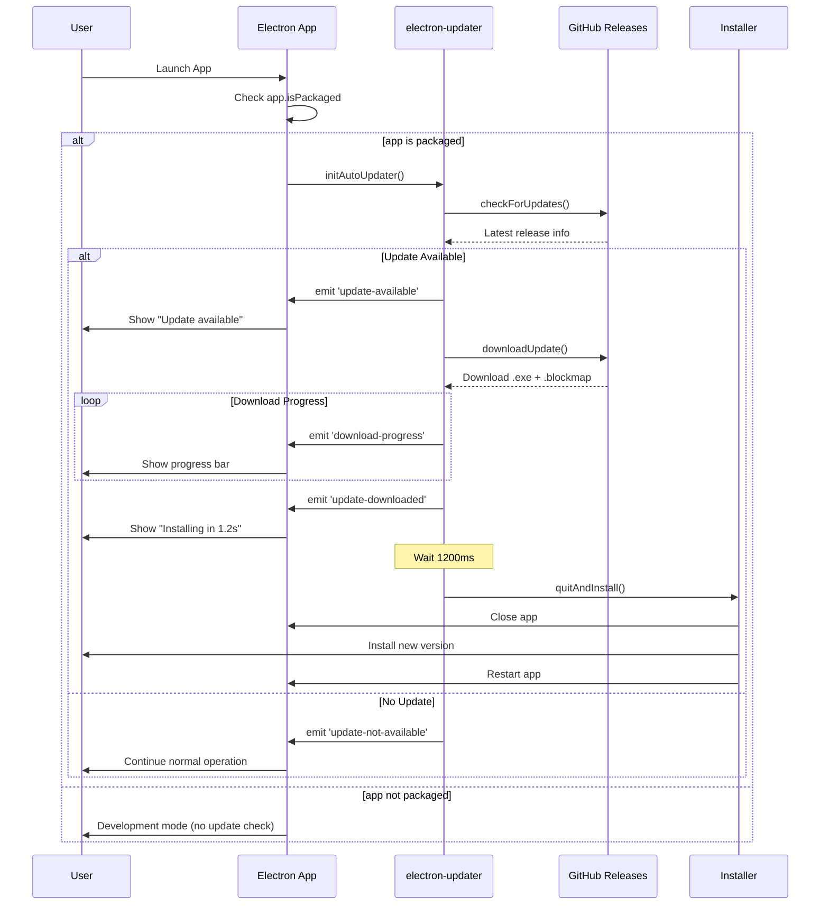

---

## 7. Build & Release Pipeline

```mermaid
flowchart LR
    subgraph "Local Development"
        Dev[Developer]
        Code[Write Code]
        Commit[git commit]
        Push[git push]
        
        Dev --> Code
        Code --> Commit
        Commit --> Push
    end
    
    subgraph "GitHub Actions"
        Trigger[Push to main]
        Checkout[Checkout Code]
        Setup[Setup Node 20]
        Install[npm ci]
        Release[npm run release]
        
        Trigger --> Checkout
        Checkout --> Setup
        Setup --> Install
        Install --> Release
    end
    
    subgraph "Semantic Release"
        Analyze[Analyze Commits]
        Version[Bump Version]
        Notes[Generate Notes]
        Build[npm run dist]
        Publish[Create GitHub Release]
        
        Analyze --> Version
        Version --> Notes
        Notes --> Build
        Build --> Publish
    end
    
    subgraph "electron-builder"
        ViteBuild[vite build → dist/]
        Package[Package Electron App]
        NSIS[Create NSIS Installer]
        
        ViteBuild --> Package
        Package --> NSIS
    end
    
    subgraph "GitHub Release"
        Upload[Upload Assets]
        Tag[Create Git Tag]
        Assets[.exe, .blockmap, .yml]
        
        Upload --> Tag
        Upload --> Assets
    end
    
    Push --> Trigger
    Release --> Analyze
    Build --> ViteBuild
    NSIS --> Publish
    Publish --> Upload
    
    Assets --> EndUsers[End Users<br/>Auto-update]
    
    style Release fill:#ffe7e7
    style Build fill:#fff4e6
    style Publish fill:#e7ffe7
    style EndUsers fill:#e1f5ff
```

---

## 8. State Management Pattern

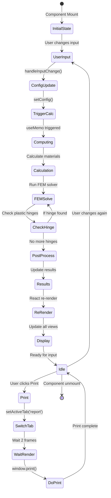

---

## 9. Load Combination Strategy

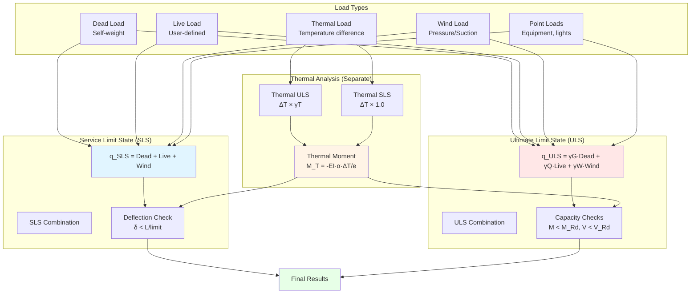

---

## 10. Component Interaction Diagram

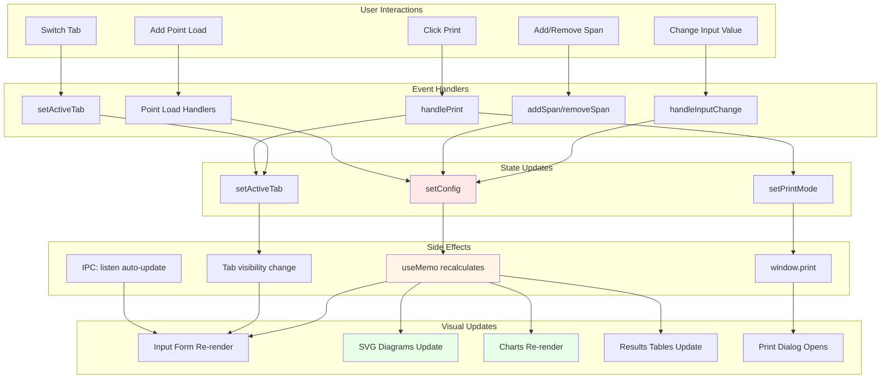

---

## 11. Timoshenko vs Euler-Bernoulli Comparison

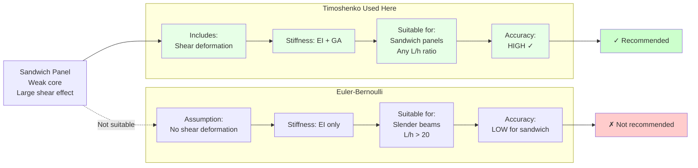

---

## 12. File Structure Tree

```
sanwichpanel_caculation/
│
├── 📁 .github/
│   └── 📁 workflows/
│       └── 📄 release.yml          ← CI/CD pipeline
│
├── 📁 public/
│   ├── 🖼️ logo_app.ico
│   ├── 🖼️ logo_app.jpg
│   └── 🖼️ vite.svg
│
├── 📁 src/
│   ├── 📄 main.jsx                 ← React entry
│   ├── 📄 index.css
│   ├── 📄 App.jsx ⭐               ← MAIN COMPONENT (2859 lines)
│   ├── 📄 App.css
│   └── 📁 assets/
│
├── 📄 main.cjs ⭐                   ← Electron main process
├── 📄 index.html
├── 📄 vite.config.js               ← base: './' for Electron
├── 📄 package.json                 ← Dependencies & build config
├── 📄 eslint.config.js
├── 📄 README.md
├── 📄 ARCHITECTURE.md              ← This documentation
└── 📄 SYSTEM_DIAGRAMS.md           ← Mermaid diagrams

⭐ = Critical files
```

---

## 13. Technology Stack Layers

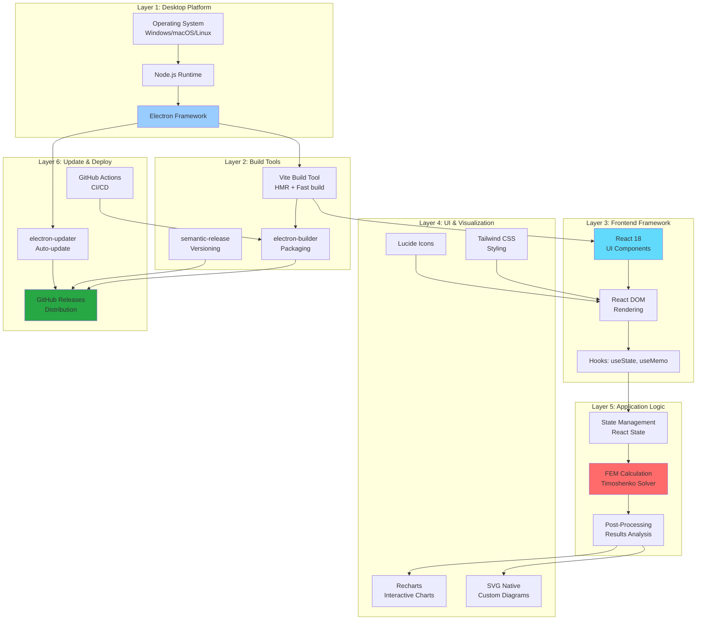

---

## Ghi Chú

- Tất cả sơ đồ trên có thể xem trực tiếp trên GitHub (hỗ trợ Mermaid)
- Hoặc sử dụng các công cụ như:
  - [Mermaid Live Editor](https://mermaid.live/)
  - VS Code extension: Markdown Preview Mermaid Support
  - Draw.io (import Mermaid syntax)

---

**Được tạo bởi**: AI Coding Assistant  
**Ngày**: 2026-01-29
